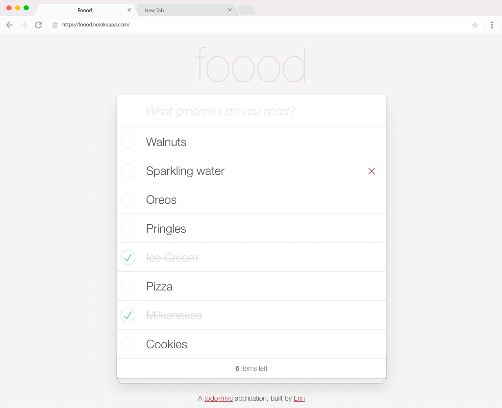

# Todo/Grocery List SPA

Dynamic and database-driven jQuery implementation of the [TodoMVC](http://todomvc.com/) project app.

Visit the deployed application: [https://foood.herokuapp.com/](https://foood.herokuapp.com/)

____
### Implementation Details:
* Built on Ruby on Rails framework
* TDD using RSpec & Factory Girl gems
* RESTful JSON API from Rails to fetch data
* JavaScript/jQuery for dynamic content updates

____
### TODO:
```
- @TODO: Add clear completed action
- @TODO: Add all/active/completed filters
- ✅ Add delete task functionality
- ✅ Add task counter
```

____
### Credits:
* [TodoMVC](http://todomvc.com/) for CSS

____
### Screenshot:

